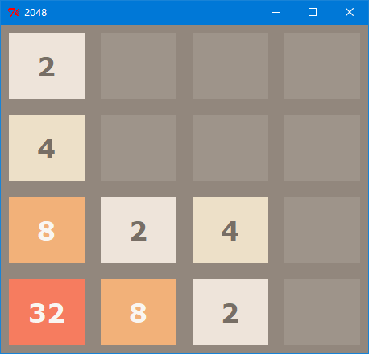

# Introduction
A GUI 2048 implementation written in Python and tkinter library.
Both Python 2.x and Python 3.x are supported.

## Usage
Make sure the `tkinter` module is available for your Python interpreter.
* For Linux system, the tk package may not be installed by default. So you need to install it first.
  
  - For Ubuntu and Debian based distributions:
  ```
  $ sudo apt-get install python-tk 	# For Python 2.x
  $ sudo apt-get install python3-tk 	# For Python 3.x
  ```

  - For RHEL, Fedora and CentOS based distributions:
  ```
  $ sudo yum install python2-tkinter	# For Python 2.x
  $ sudo yum install python3-tkinter 	# For Python 3.x
  ``` 
  
  **Notice**: `python2-tkinter` may not be found in CentOS 7.x Everything iso. 
  
  Then you can launch the game:
  ```
  $ python pytk2048.py
  ```

* For Windows and macOS, the tk is installed within the Python distribution by default. So you can simply run
  ```
  python pytk2048.py
  ```

  Here is the screenshot on Windows:

  

After you launch the 2048 game UI, you can either press `arrow keys` or  `w, a, s, d` keys to play the game, enjoy it!
