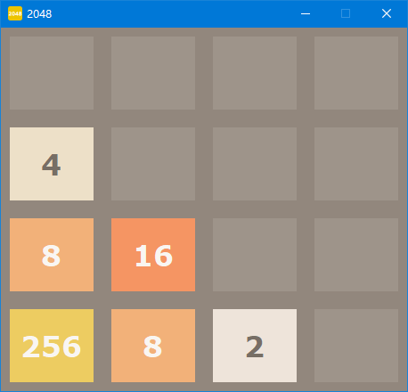

# Introduction
A GUI 2048 implementation written in Python and tkinter library.
Both Python 2.x and Python 3.x are supported.

## Usage
```
$ python pytk2048.py
```

Here is the screenshot on Windows:



